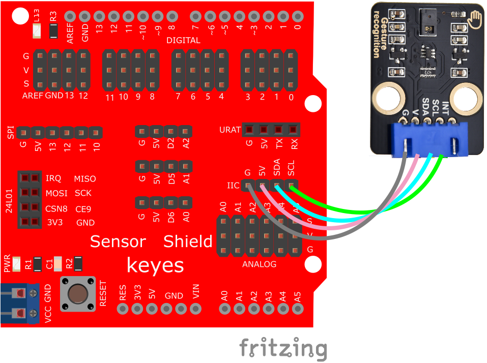

# 使用Arduino IDE开发


## 1. Arduino简介  

Arduino是一款开源电子平台，专为DIY爱好者和学习者设计，使他们能够轻松创建互动电子项目。 从2005年发布以来，Arduino因其易用性和灵活性而受到广泛欢迎。Arduino的硬件包括多种型号的开发板，软件上则配备简单易用的Arduino IDE，使用户能够通过C/C++编程语言直接与硬件交互。Arduino平台支持各种传感器和执行器，适用于多个应用领域，包括自动化、机器人、艺术等。因此，它成为了教育、创客运动和原型开发的首选工具。  

## 2. 接线图  

  

## 3. 导入库文件 

在Arduino编辑器中，通过“项目—导入库—管理库”找到并安装Paj7620库。


点击安装
安装后，在示例中会找到“Gesture PAJ7620”示例。该库提供了两个示例脚本，分别用于检测9种和15种手势。需要注意的是，在手势测试时会有0.8秒的反应延迟。 

## 4. 测试代码 

```cpp  
#include <Wire.h>  
#include "paj7620.h"  

/*  
注意：当您想要识别前进/后退手势时，您的手势反应时间必须少于 GES_ENTRY_TIME（0.8 秒）。  
您也可以根据实际情况调整反应时间。  
*/  

#define GES_REACTION_TIME 500 // 可调整反应时间，根据实际情况设置。  
#define GES_ENTRY_TIME 800 // 当您想识别前进/后退手势时，手势反应时间必须少于 GES_ENTRY_TIME（0.8秒）。  
#define GES_QUIT_TIME 1000 // 手势退出时间，设置为 1 秒。  

void setup()  
{  
    uint8_t error = 0;  
    Serial.begin(9600);  
    Serial.println("\nPAJ7620U2 测试演示：识别9个手势。");  
    error = paj7620Init(); // 初始化 Paj7620 寄存器  
    if (error)  
    {  
        Serial.print("初始化错误，代码：");  
        Serial.println(error);  
    }  
    else  
    {  
        Serial.println("初始化成功");  
    }  
    Serial.println("请输入您的手势：\n");  
}  

void loop()  
{  
    uint8_t data = 0, data1 = 0, error;  

    error = paj7620ReadReg(0x43, 1, &data); // 从 Bank_0_Reg_0x43/0x44 读取手势结果。  
    if (!error)  
    {  
        switch (data)   
        {  
            case GES_RIGHT_FLAG:  // 识别右手势  
                delay(GES_ENTRY_TIME);  
                paj7620ReadReg(0x43, 1, &data);  
                if(data == GES_FORWARD_FLAG)  
                {  
                    Serial.println("前进");  
                    delay(GES_QUIT_TIME);  
                }  
                else if(data == GES_BACKWARD_FLAG)  
                {  
                    Serial.println("后退");  
                    delay(GES_QUIT_TIME);  
                }  
                else  
                {  
                    Serial.println("右");  
                }  
                break;  

            case GES_LEFT_FLAG:  // 识别左手势  
                delay(GES_ENTRY_TIME);  
                paj7620ReadReg(0x43, 1, &data);  
                if(data == GES_FORWARD_FLAG)  
                {  
                    Serial.println("前进");  
                    delay(GES_QUIT_TIME);  
                }  
                else if(data == GES_BACKWARD_FLAG)  
                {  
                    Serial.println("后退");  
                    delay(GES_QUIT_TIME);  
                }  
                else  
                {  
                    Serial.println("左");  
                }  
                break;  

            case GES_UP_FLAG:  // 识别上手势  
                delay(GES_ENTRY_TIME);  
                paj7620ReadReg(0x43, 1, &data);  
                if(data == GES_FORWARD_FLAG)  
                {  
                    Serial.println("前进");  
                    delay(GES_QUIT_TIME);  
                }  
                else if(data == GES_BACKWARD_FLAG)  
                {  
                    Serial.println("后退");  
                    delay(GES_QUIT_TIME);  
                }  
                else  
                {  
                    Serial.println("上");  
                }  
                break;  

            case GES_DOWN_FLAG:  // 识别下手势  
                delay(GES_ENTRY_TIME);  
                paj7620ReadReg(0x43, 1, &data);  
                if(data == GES_FORWARD_FLAG)  
                {  
                    Serial.println("前进");  
                    delay(GES_QUIT_TIME);  
                }  
                else if(data == GES_BACKWARD_FLAG)  
                {  
                    Serial.println("后退");  
                    delay(GES_QUIT_TIME);  
                }  
                else  
                {  
                    Serial.println("下");  
                }  
                break;  

            case GES_FORWARD_FLAG:  // 识别前进手势  
                Serial.println("前进");  
                delay(GES_QUIT_TIME);  
                break;  

            case GES_BACKWARD_FLAG:  // 识别后退手势  
                Serial.println("后退");  
                delay(GES_QUIT_TIME);  
                break;  

            case GES_CLOCKWISE_FLAG:  // 识别顺时针手势  
                Serial.println("顺时针");  
                break;  

            case GES_COUNT_CLOCKWISE_FLAG:  // 识别逆时针手势  
                Serial.println("逆时针");  
                break;  

            default:  
                paj7620ReadReg(0x44, 1, &data1);  
                if (data1 == GES_WAVE_FLAG)  // 识别挥手手势  
                {  
                    Serial.println("挥手");  
                }  
                break;  
        }  
    }  
    delay(100);  // 等待 100 毫秒  
}  
```  

## 4. 代码说明  

这段代码通过 **Paj7620** 传感器识别手势并输出相应的指令。这个传感器能够识别多种手势，包括上下左右、前进、后退等。

### 代码结构
1. **头文件引入**
   ```cpp
   #include <Wire.h>  
   #include "paj7620.h"  
   ```
   - `Wire.h`: 这个库用于通过 I2C 总线与设备通信。
   - `paj7620.h`: 这是 Paj7620 传感器的库，包含与该传感器的交互函数。

2. **常量定义**
   ```cpp
   #define GES_REACTION_TIME 500 // 可调整反应时间，根据实际情况设置。  
   #define GES_ENTRY_TIME 800 // 回应前进/后退手势的时间限制（0.8秒)。  
   #define GES_QUIT_TIME 1000 // 退出的时间（1秒）。  
   ```
   - `GES_REACTION_TIME`: 手势识别的反应时间，可以根据需要调整。
   - `GES_ENTRY_TIME`: 调整的时间限制，确保手势在此时间内得到响应。
   - `GES_QUIT_TIME`: 识别后所需等待的时间。

3. **初始化设置**
   ```cpp
   void setup()  
   {  
       uint8_t error = 0;  
       Serial.begin(9600);  
       Serial.println("\nPAJ7620U2 测试演示：识别9个手势。");  
       error = paj7620Init(); // 初始化 Paj7620 寄存器  
       if (error)  
       {  
           Serial.print("初始化错误，代码：");  
           Serial.println(error);  
       }  
       else  
       {  
           Serial.println("初始化成功");  
       }  
       Serial.println("请输入您的手势：\n");  
   }  
   ```
   - `setup()`函数用于初始化代码运行时的设置。
   - 开启串口通信并设置波特率为9600。
   - 调用 `paj7620Init()` 函数来初始化传感器的寄存器。如果返回错误，则输出错误编码；否则，输出初始化成功的信息。

4. **主循环**
   ```cpp
   void loop()  
   {  
       uint8_t data = 0, data1 = 0, error;  
       error = paj7620ReadReg(0x43, 1, &data); // 从 Bank_0_Reg_0x43/0x44 读取手势结果。  
       if (!error)  
       {  
           switch (data)   
           {  
               // 各种手势处理...
           }  
       }  
       delay(100);  // 等待 100 毫秒  
   }  
   ```
   - `loop()`函数是程序的主循环，会不断执行。
   - 读取传感器的手势数据（寄存器 `0x43`）并存储在变量 `data` 中。
   - 如果读取成功，不同的 `case` 会根据返回的手势数据执行相应的动作。

### 手势识别和输出
在主循环中，通过 `switch` 语句处理不同的手势识别。下面是一些手势及其相应的逻辑：

- **右手势**
  ```cpp
  case GES_RIGHT_FLAG:  
      delay(GES_ENTRY_TIME);  
      paj7620ReadReg(0x43, 1, &data);  
      if(data == GES_FORWARD_FLAG)  
      {  
          Serial.println("前进");  
          delay(GES_QUIT_TIME);  
      }  
      else if(data == GES_BACKWARD_FLAG)  
      {  
          Serial.println("后退");  
          delay(GES_QUIT_TIME);  
      }  
      else  
      {  
          Serial.println("右");  
      }  
      break;  
  ```
  - 当检测到右手势后，程序会等待 `GES_ENTRY_TIME` 毫秒，之后再次读取手势数据。
  - 如果是“前进”或“后退”的手势，则分别输出相应的信息，并在输出后再等待 `GES_QUIT_TIME` 毫秒。
  - 如果检测到的手势不是“前进”或“后退”，则输出“右”。

- **其他手势**
  - 各个手势（左、上、下、前进、后退、顺时针、逆时针）使用类似的逻辑进行处理。
  
- **挥手手势**
  ```cpp
  default:  
      paj7620ReadReg(0x44, 1, &data1);  
      if (data1 == GES_WAVE_FLAG)  
      {  
          Serial.println("挥手");  
      }  
      break;  
  ```
  - 如果未检测到特定手势，程序会检查是否为挥手手势，并输出相关信息。

## 5. 测试结果  

按照接线图连接模块并烧录程序，上电后，打开串口监视器并设置波特率为9600，当在模块前方展示手势时，串口监视器将实时显示对应的手势识别结果，如“前进”、“后退”等。


